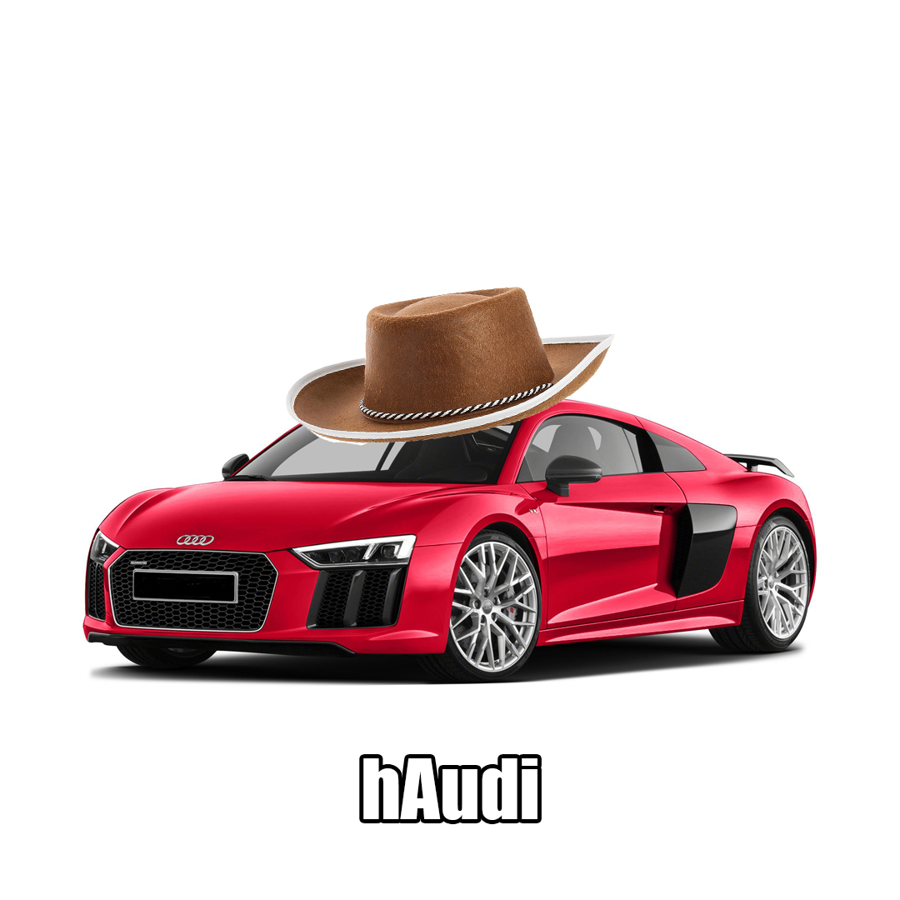

Example

In this meme, image compositing is used to combine two visual elements. Selection tools have been used to isolate the image of a cowboy hat, and the lay the element over a backgroun image that includes an Audi vehicle. The compositing visually puts the hat on the car. The textual element then uses wordplay to amplify the visual combination.

When Your Homework is 2 Questions http://altscholarship.com/makemedia/sites/default/files/2019-02/Screen%20Shot%202019-02-18%20at%2010.26.11%20PM.png
In this meme, arrangement is used to create a two-part structure. The image in the top portion of the image creates an optimistic message through facial expression which is reinforced with the text. This sentiment is then fliped in the lower portion where the visual suggests suggests disappointment and the text explains the source. 
