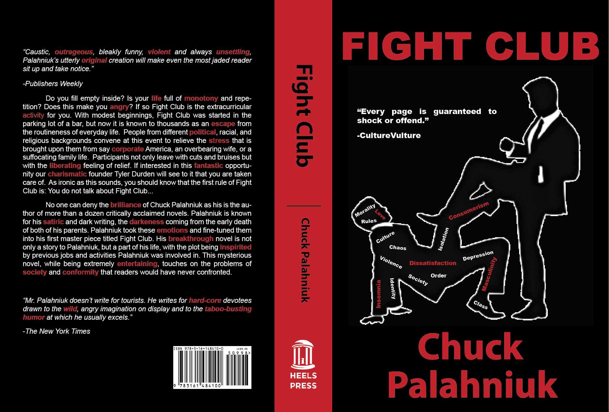
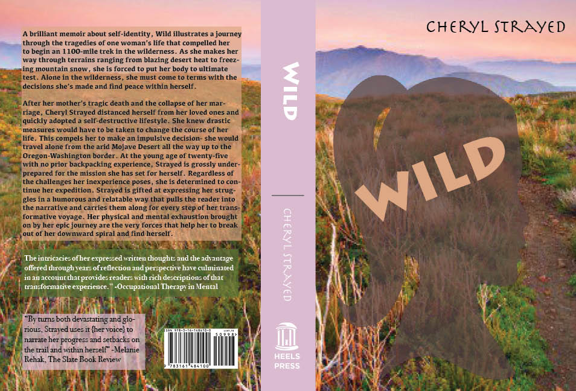
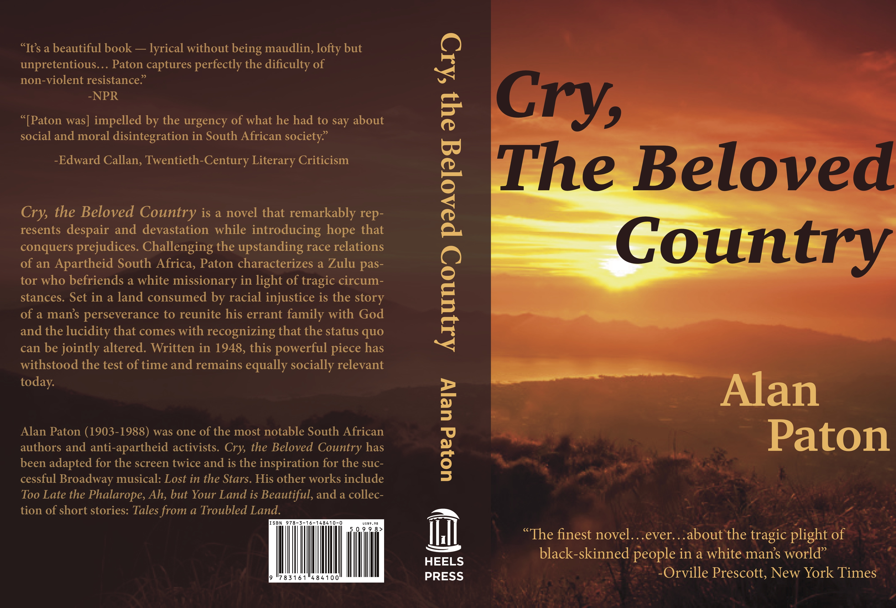
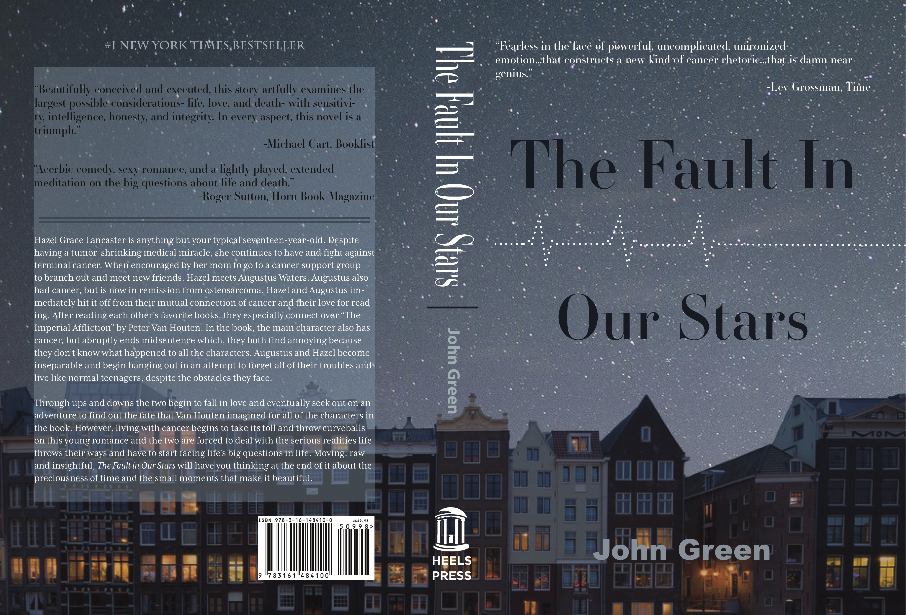

# Student Examples

# Commentaries

Book Cover 1 (Fight Club):

The design is very good here. I like that you have differentiated the quotes on the back cover. Your summary is very strong and creative. I think the second paragraph just has some edits I would make. First, I would delte/change “After graduating from the University of Oregon, Palahniuk began his career writing short stories.” I don’t think this adds to the biography.  Also, I would be careful not to begin two sentences in a row with “this.”

Book Cover 2 

Front Cover: I like the concept here! I wouldn’t use a quote on this front cover (and FYI it is a Book, not “Bok”). It might be the exporting here, but the title is hard to read against this cover and the author’s name is impossible to see. I would use a map that seems a little more worn or something vintage looking (like https://s-media-cache-ak0.pinimg.com/originals/59/4a/a4/594aa46ba7a214800f0fd3c03188833e.jpg). I think it might work well to have the map span the back and the front, so the journey becomes the focus on the total cover.

Spine:  I like this color you selected, I think it works well. The line between the title and the author is a little off.

Back: I like that you put an image back here. I would only suggest trying to use an image of Cheryl Strayed rather than one from the movie. If you do a map throughout, I don’t think you would need an image back here at all. 
The summary is good overall and I can see why you wanted to put an image back there, it does feel a little text heavy. I would just delete the third paragraph. I think the first two are enough here.

Book Cover 3:

Excellent work! The only two things I have for you would be to try to have a different picture on the spine or try to lighten the color on the spine, it seems to separate from the front cover too much. The second, is using “THE” or “The” on the front quote; I am not sure if that was intentional or not. The letters are distracting, so if it is in all caps then I would try to just format it “the.”

Book Cover 4:

Love this design!! Very good. The back feels a little text heavy, I wonder if you just use two quotes instead of three? Or move one to the front cover? Other than that this is perfect!
Great work.

